# Rekurse

**A playable video-feedback instrument for the browser.**

Point a camera at its own screen and the picture folds back into itself, over and over. Rekurse runs that loop as a simulation on your graphics card. Every frame is fed back through the dials you set, music nudges the system from outside, and patterns grow that neither you nor the music planned.

It is one HTML file. Download it, open it in Chrome or Edge, and play. No install, no account, nothing sent anywhere.

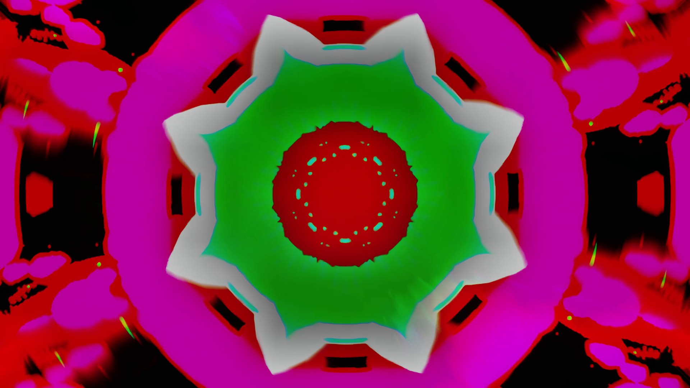

## Play it

1. Download `Rekurse.html` from the [latest release](../../releases/latest).
2. Open it in **Chrome or Edge**. Firefox and Safari run it, but much more slowly, and video export needs Chrome or Edge.
3. Read the safety notice, then turn the dials. Start with the presets, then use the microphone, system audio or a music file to let sound into the loop.

## What makes it different

- **Homeostasis.** A luminance ledger keeps account of the light in the loop and inhibits regions that are running away. The loop stays alive for hours instead of burning out to white or fading to black, and it keeps finding new balance points while you play.
- **Physics, not canned effects.** Past frames sit inside a simulated sheet of air, water or glass. Older frames lie deeper in it, so they are bent, tinted and colour-split more, and caustics play across the surface. Reaction-diffusion, Belousov–Zhabotinsky waves and Chladni plates can grow inside the loop too.
- **Music as a perturbation.** A beat tracker and per-band analysis push on the loop instead of driving it, so the sound and the picture shape each other. A plate can be played by the music directly.
- **Comfort guardrails.** A luminance ceiling, a flash guard and band softening are on by default.

## Make things with it

- **Scenes and replay.** Capture scenes and let Rekurse glide between them on its own.
- **Recipe codes.** Share a whole tuning as a short code.
- **Video.** Record live, or render a whole song offline from an audio file. A render draws every frame at full quality with the sound in exact sync, however heavy the scene.
- **Live wallpapers.** Export a wallpaper for [Lively](https://www.rocksdanister.com/lively/) on Windows or an HTML wallpaper app on Android. Choose a light picture-only version, or one with a compact live control panel.

## The controls

Every dial sits in one scrolling strip of panels, grouped by what it does to the loop: energy in, energy out, shape, the physical medium, sources, the excitable media and the guardrails.

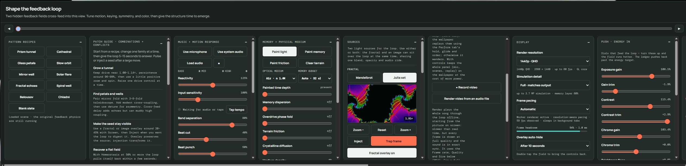

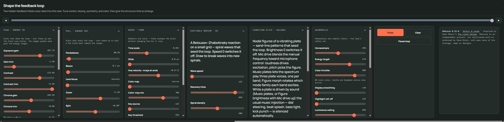

## Gallery

Stills from a video made with Rekurse.

<table>
<tr><td>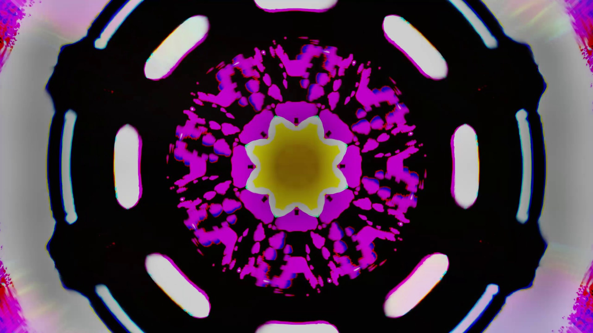</td><td>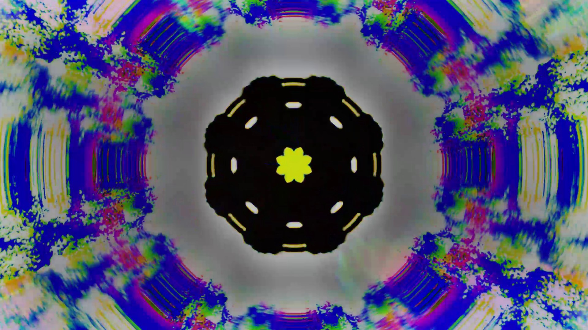</td></tr>
<tr><td>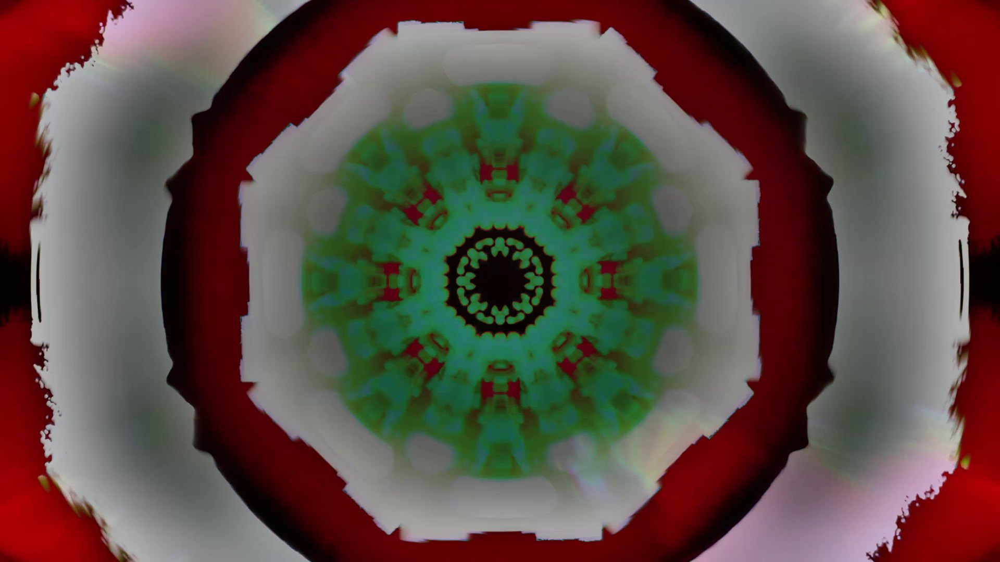</td><td>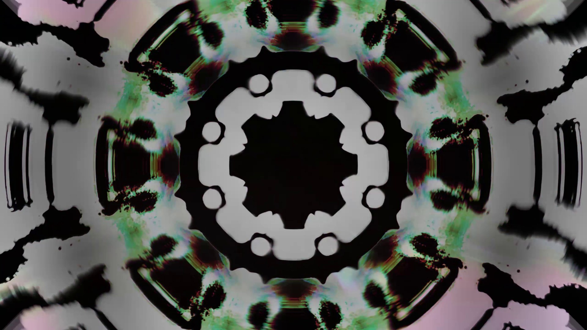</td></tr>
<tr><td>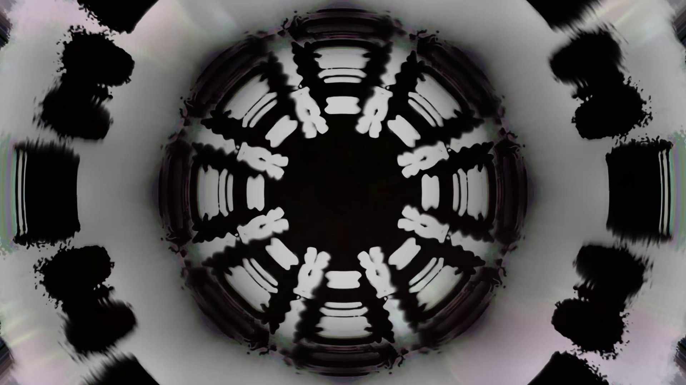</td><td>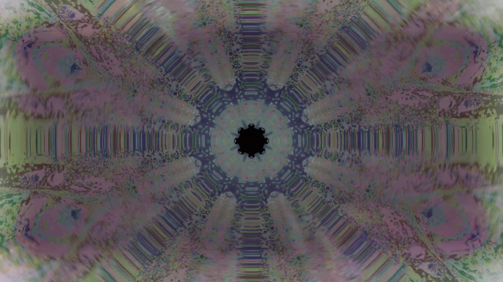</td></tr>
<tr><td>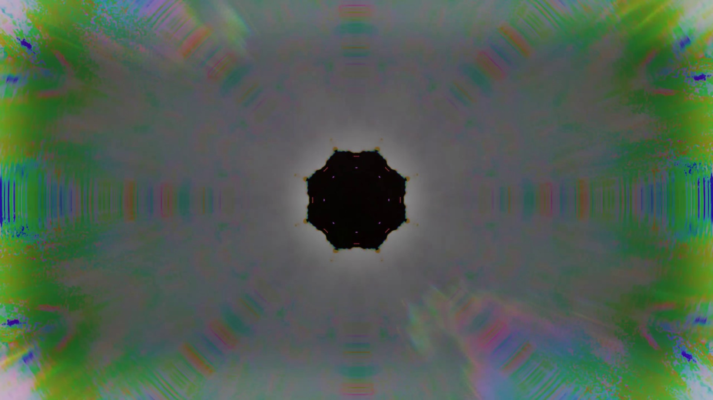</td><td>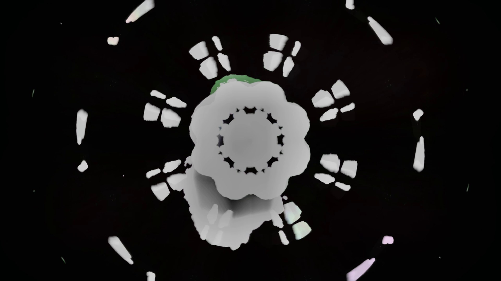</td></tr>
<tr><td>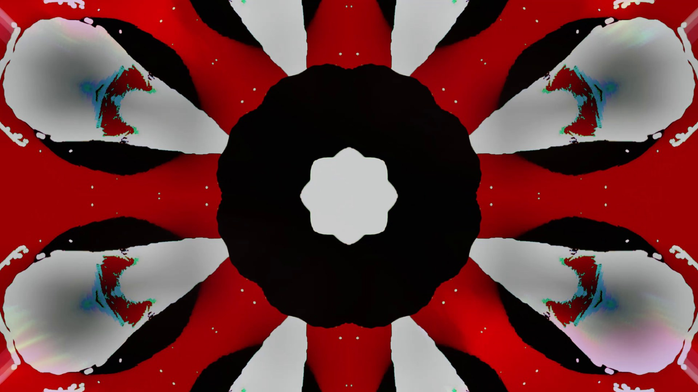</td><td>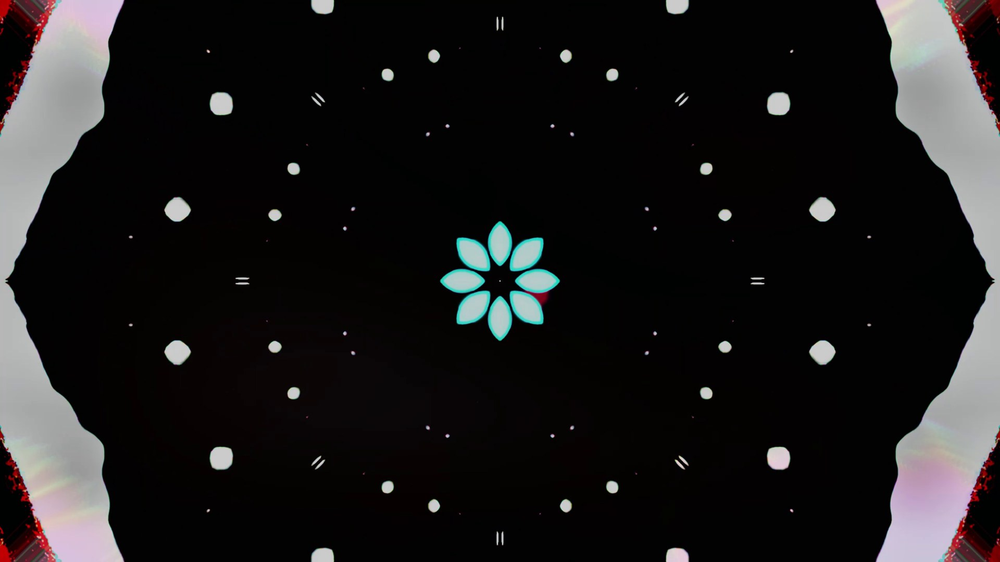</td></tr>
<tr><td>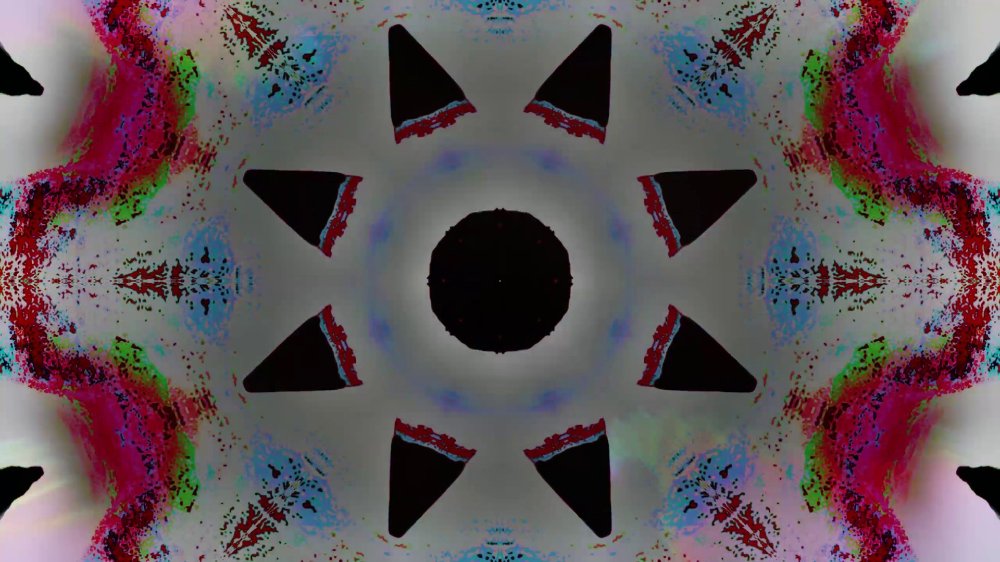</td><td>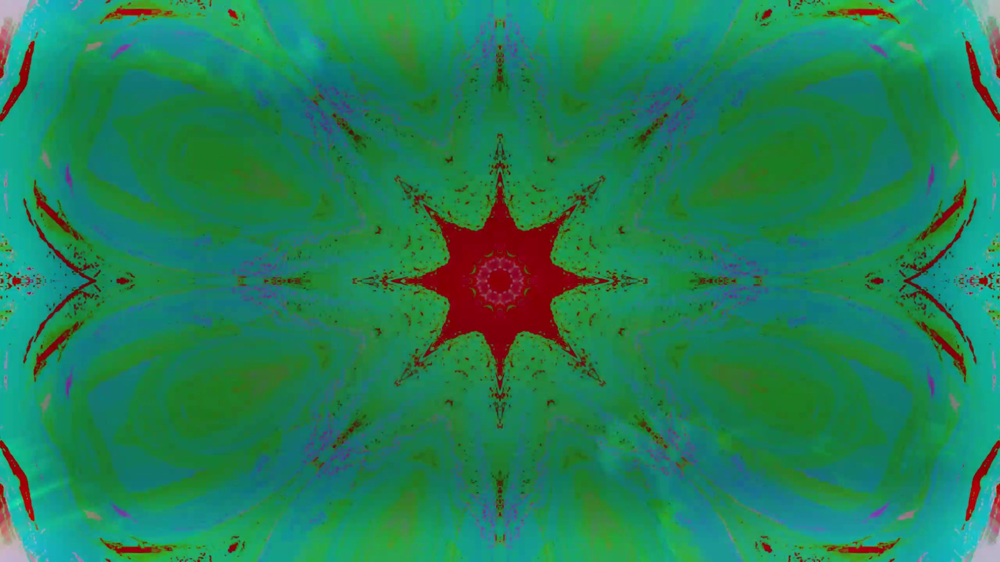</td></tr>
<tr><td>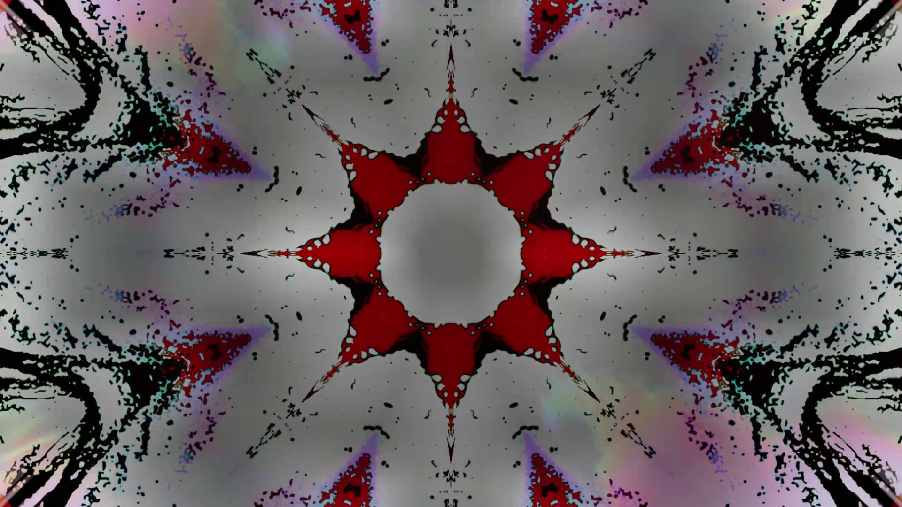</td><td>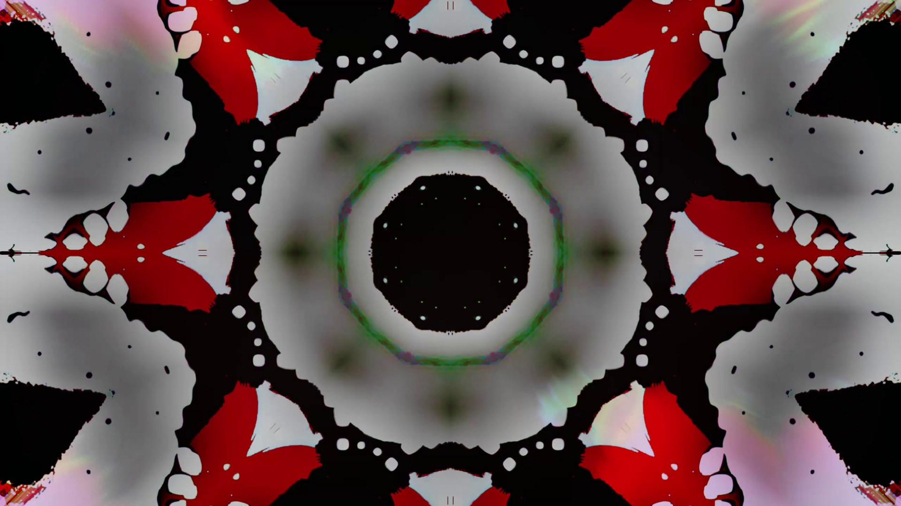</td></tr>
</table>

## Safety

Rekurse makes bright, moving and sometimes flickering light. If you or anyone nearby is sensitive to flashing images, don't use it. Stop if you feel unwell. The comfort limits are on by default; turning them down makes stronger light.

## Inspirations

**Dave Blair, [The Light Herder](https://www.thelightherder.com/).** An analog HD video-feedback kinetic sculpture built from cameras, monitors, video switchers and beam-splitter glass. Seeing it run in real time is what made me want a playable version of that loop. Rekurse is an independent project. It is not affiliated with or endorsed by Dave Blair, and it uses none of his footage, name or designs.

**The Windows Media Player 12 visualizations** (Microsoft, around 2010). Alchemy, Bars and Waves, Battery: the built-ins a generation of us grew up with. They planted the idea that music could perturb an image rather than just decorate it.

**The merger.** I wondered if the two could be one thing: a feedback loop that grows novel patterns out of music's influence on it. That question is Rekurse.

Rekurse is not affiliated with, sponsored by or endorsed by Microsoft. Windows Media Player is a trademark of Microsoft Corporation, named here only to credit an inspiration. Video feedback itself is an old technique with a long history among video artists.

## Terms

Rekurse is free to use. Videos, wallpapers and scenes you make with it are yours. Please don't redistribute modified copies or sell it. It is provided as is, without warranty, and its comfort settings are not medical advice.

The page embeds the DM Mono and Manrope typefaces under the SIL Open Font License 1.1.

Copyright (c) 2026 Kristian. All rights reserved. This repository holds the released app only; the source is not published.
